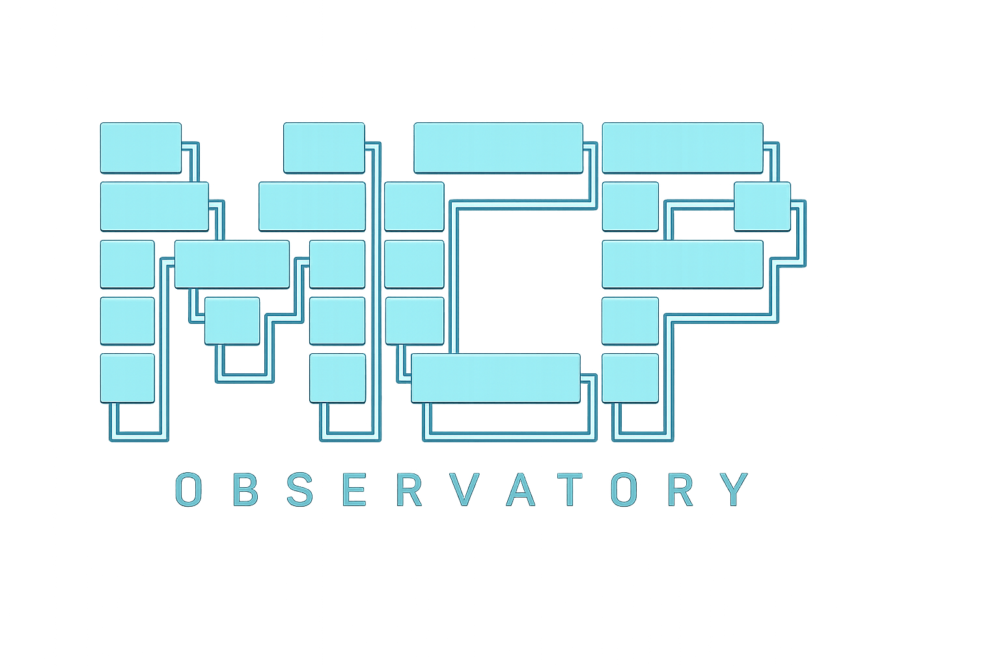

<p align="center">
  
</p>

<h1 align="center">MCP Observatory</h1>

[](https://github.com/KryptosAI/mcp-observatory/actions/workflows/ci.yml)
[](https://github.com/KryptosAI/mcp-observatory/actions/workflows/codeql.yml)
[](https://github.com/KryptosAI/mcp-observatory/actions/workflows/coverage.yml)
[](https://www.npmjs.com/package/@kryptosai/mcp-observatory)
[](https://github.com/KryptosAI/mcp-observatory/stargazers)
[](./LICENSE)

<details>
<summary>More badges</summary>

[](https://securityscorecards.dev/viewer/?uri=github.com/KryptosAI/mcp-observatory)
[](./.github/dependabot.yml)
[](./.github/workflows/release.yml)
[](https://www.npmjs.com/package/@kryptosai/mcp-observatory)
[](./package.json)
[](https://smithery.ai/server/@kryptosai/mcp-observatory)
[](https://glama.ai/mcp/servers/KryptosAI/mcp-observatory)
[](./CONTRIBUTORS.md)
[](https://gitee.com/williamweishuhn/mcp-observatory)
[](https://gitee.com/williamweishuhn/mcp-observatory)
[](https://registry.modelcontextprotocol.io)
[](https://mcpmarket.com)
[](https://mcp-hub.cn)
[](https://opentools.ai)
[](https://gitee.com/williamweishuhn/mcp-observatory)

</details>

**Secure the MCP servers you're building.** MCP Observatory is the CI-native security tool for teams shipping custom MCP servers. Test during development, catch schema drift, simulate attacks, and generate compliance evidence — before agents depend on your servers.

Also available in [Simplified Chinese](README.zh-CN.md).

> **Runtime enforcement:** Use [mcp-seatbelt](https://github.com/KryptosAI/mcp-seatbelt) to block dangerous MCP tool calls at runtime based on observatory scan results.

## Get Started

```bash
npx @kryptosai/mcp-observatory demo
```

Scans your configured MCP servers (or a built-in demo server if you have none) and shows your safety grade in seconds. No config, no arguments — instant value.

Have servers? Scan them all:

```bash
npx @kryptosai/mcp-observatory
```

Test a specific server:

```bash
npx @kryptosai/mcp-observatory test npx -y @modelcontextprotocol/server-everything
```

Add CI + Code Scanning in one command:

```bash
npx @kryptosai/mcp-observatory setup-ci --all --command "npx -y my-mcp-server" --sarif --schedule weekly
```

## Why MCP Observatory

MCP servers are becoming production dependencies. If agents rely on them, teams need a way to catch broken tools, unsafe schemas, schema drift, slow responses, and security footguns before those failures reach users.

Observatory gives maintainers and teams:

- **One-command CI setup** with `setup-ci --all`
- **Profile-mapped audits** with `audit --profile nsa-mcp`
- **MCP receipts** that package target, evidence, verdict, action, and reproduction commands
- **MCP risk graphs** that group servers by capability boundary, receipt state, CI posture, and recommended action
- **Action receipts** that say `allow`, `gate`, `rerun`, `quarantine`, or `escalate`
- **GitHub PR comments** for compatibility, drift, and security findings
- **GitHub Code Scanning SARIF** for normalized MCP findings
- **Health score badges** for public trust signals
- **Record/replay/verify** workflows for regression testing
- **MCP server mode** so agents can inspect other MCP servers directly
- **Production support path** for hosted history, private repo reporting, owner-ready remediation, support, and fleet visibility

See [GitHub Code Scanning for MCP servers](./docs/github-code-scanning-for-mcp.md), [MCP Receipts](./docs/mcp-receipts.md), [Safety Methodology](./docs/methodology.md), [MCP Server Safety Index](./docs/mcp-server-safety-index.md), [MCP Observatory Contributors](./docs/contributor-recognition.md), [hosted client contract](./docs/api.md), [repository boundary](./docs/repository-boundary.md), [open core boundary](./docs/commercial-boundary.md), and [commercial support](./COMMERCIAL.md).

### Self-Assessment

We scan ourselves with mcp-observatory on every release. [See results →](docs/self-assessment.md)

## For Security And Platform Teams

MCP servers are becoming part of the AI software supply chain. Agents need reliable, testable, auditable tools before those tools become dependencies in mission-critical workflows.

Whether you're shipping one MCP server or running a fleet, MCP Observatory gives you CI-native security scoring, attack simulation, schema drift detection, SARIF/HTML/Markdown reports, and GitHub Code Scanning — from your first `npx` command to production deployment. Local development stays free; teams with a near-term production approval decision can use the fixed-scope [MCP Release Gate Pilot](./docs/paid-pilot-offer.md).

## Production Support

Local OSS use stays free under MIT. Teams running MCP in production can use the [MCP Release Gate Pilot](./docs/paid-pilot-offer.md) for safe-mode evidence, SARIF/Code Scanning setup, CI rollout, private reporting, and owner-ready remediation notes. The fixed public entry offer is `$15,000` for 1-3 critical MCP servers over ten business days; broader work is scoped after the release decision.

The open source repo is the portable evidence engine. Hosted authentication, retention, organization workflows, fleet coordination, and private intelligence stay outside the OSS package; see the [repository boundary](./docs/repository-boundary.md).

Run `npx @kryptosai/mcp-observatory cloud`, open a pilot request from the issue chooser, or see [COMMERCIAL.md](./COMMERCIAL.md). Also see [privacy](./PRIVACY.md), [campaign attribution](./docs/campaign-attribution.md), and [terms for production use](./TERMS.md).

## How It Compares

| Feature | mcp-observatory | Snyk agent-scan | Cisco mcp-scanner | agent-shield |
|---|---|---|---|---|
| MCP-native | ✓ | ✓ | ✓ | ✓ |
| Attack simulation | ✓ | ✗ | ✗ | ✗ |
| Schema drift detection | ✓ | ✗ | ✗ | ✗ |
| Record/replay/verify | ✓ | ✗ | ✗ | ✗ |
| Health scoring (0-100) | ✓ | ✗ | ✗ | ✗ |
| SARIF output | ✓ | ✓ | ✓ | ✓ |
| CI/CD native (setup-ci) | ✓ | ✓ | ✓ | ✓ |
| Public Safety Index | ✓ | ✗ | ✗ | ✗ |
| Runtime enforcement via mcp-seatbelt | ✓ | ✗ | ✗ | ✗ |

## Quick Start

Scan every MCP server in your Claude config:

```bash
npx @kryptosai/mcp-observatory
```

Go deeper — also invoke safe tools to verify they actually run:

```bash
npx @kryptosai/mcp-observatory scan deep
```

Test a specific server:

```bash
npx @kryptosai/mcp-observatory test npx -y @modelcontextprotocol/server-everything
```

Add it to Claude Code as an MCP server:

```bash
claude mcp add mcp-observatory -- npx -y @kryptosai/mcp-observatory serve
```

Or add it manually to your config:

```json
{
  "mcpServers": {
    "mcp-observatory": {
      "command": "npx",
      "args": ["-y", "@kryptosai/mcp-observatory", "serve"]
    }
  }
}
```

## Commands

| Command | What it does |
|---------|-------------|
| `scan` | Auto-discover servers, check them, and run safe attack-readiness simulation by default |
| `scan deep` | Scan, run safe attack simulation, and also invoke safe tools to verify they execute |
| `test <cmd>` / `test --target <file>` | Test one server and emit an action receipt by command or target config |
| `record <cmd>` | Record a server session to a cassette file for offline replay |
| `replay <cassette>` | Replay a cassette offline — no live server needed |
| `verify <cassette> <cmd>` | Verify a live server still matches a recorded cassette |
| `diff <base> <head>` | Compare two run artifacts for regressions and schema drift |
| `watch <config>` | Watch a server for changes, alert on regressions |
| `suggest` | Detect your stack and recommend MCP servers from the registry |
| `serve` | Start as an MCP server for AI agents |
| `lock` | Snapshot MCP server schemas into a lock file |
| `lock verify` | Verify live servers match the lock file |
| `history` | Show health score trends for your MCP servers |
| `setup-ci` / `init-ci` | Create a GitHub Action and badge snippet for MCP compatibility/security checks |
| `setup-ci --sarif` | Generate a workflow that uploads normalized findings to GitHub Code Scanning |
| `setup-ci --doctor` | Inspect whether the repository has a complete CI adoption kit |
| `risk-graph --input <path>` | Merge receipts and run artifacts into JSON, Markdown, and HTML MCP risk graphs |
| `--no-attack-sim` | Opt out of the default safe attack simulation on `scan` or `test` |
| `ci-report` | Generate CI report for GitHub issue creation |
| `enterprise-report` | Generate a static production/security report from run artifacts |
| `score <cmd>` | Score an MCP server's health (0-100) |
| `badge <cmd>` | Generate an SVG health score badge for README |
| `cloud` | Show hosted reporting, security review, and enterprise pilot options |

Run with no arguments for an interactive menu:

## What It Does

**Check capabilities** — connects to a server and verifies tools, prompts, and resources respond correctly.

**Invoke tools** — goes beyond listing. Actually calls safe tools (no required params / readOnlyHint) and reports which ones work and which ones crash.

```bash
npx @kryptosai/mcp-observatory scan deep
```

**Detect schema drift** — diffs two runs and surfaces added/removed fields, type changes, and breaking parameter changes.

```bash
npx @kryptosai/mcp-observatory diff run-a.json run-b.json
```

**Recommend servers** — scans your project for languages, frameworks, databases, and cloud providers, then cross-references the [MCP registry](https://registry.modelcontextprotocol.io) to suggest servers you're missing.

```bash
npx @kryptosai/mcp-observatory suggest
```

Or ask your agent "what MCP servers should I add?" when running in MCP server mode.

**Security scanning** — analyzes tool schemas for dangerous patterns: shell injection surfaces, broad filesystem access, missing auth, and credential leakage in responses.

```bash
npx @kryptosai/mcp-observatory test --security npx -y my-mcp-server
```

**Record / replay / verify** — capture a live session, replay it offline in CI, and verify nothing changed. Like [VCR](https://github.com/vcr/vcr) for MCP.

```bash
# Record a session
npx @kryptosai/mcp-observatory record npx -y @modelcontextprotocol/server-everything

# Replay offline (no server needed)
npx @kryptosai/mcp-observatory replay .mcp-observatory/cassettes/latest.cassette.json

# Verify the live server still matches
npx @kryptosai/mcp-observatory verify cassette.json npx -y @modelcontextprotocol/server-everything
```

**Watch for regressions** — re-runs checks on an interval and alerts when something changes.

```bash
npx @kryptosai/mcp-observatory watch target.json
```

### Scan locations

When you run `scan`, it looks for MCP configs in:

- `~/.claude.json` (Claude Code)
- `~/Library/Application Support/Claude/claude_desktop_config.json` (Claude Desktop, macOS)
- `%APPDATA%/Claude/claude_desktop_config.json` (Claude Desktop, Windows)
- `.claude.json` and `.mcp.json` (current directory)

## Architecture

```
                    ┌─────────────────────────┐
                    │   MCP Observatory CLI    │
                    │  npx @kryptosai/mcp-     │
                    │     observatory scan     │
                    └───────────┬─────────────┘
                                │
                    ┌───────────▼─────────────┐
                    │   Config Discovery       │
                    │  (Claude, Cursor, etc.)  │
                    └───────────┬─────────────┘
                                │
              ┌─────────────────┼─────────────────┐
              ▼                 ▼                  ▼
    ┌─────────────────┐ ┌──────────────┐ ┌──────────────────┐
    │   Security Scan  │ │  Attack Sim  │ │  Schema Drift    │
    │  (shell, creds)  │ │ (tool poison)│ │  (version diff)  │
    └────────┬────────┘ └──────┬───────┘ └────────┬─────────┘
             │                 │                   │
             └─────────────────┼───────────────────┘
                               ▼
                    ┌─────────────────────┐
                    │   Health Score       │
                    │  (0-100 + verdict)   │
                    └──────────┬──────────┘
                               │
              ┌────────────────┼────────────────┐
              ▼                ▼                 ▼
    ┌──────────────┐  ┌──────────────┐  ┌──────────────┐
    │  SARIF       │  │  Markdown    │  │  CI Gateway  │
    │  (Code Scan) │  │  Report      │  │  (setup-ci)  │
    └──────────────┘  └──────────────┘  └──────────────┘
```

## CI / GitHub Action

Add Observatory to your MCP server's CI pipeline:

```bash
npx @kryptosai/mcp-observatory setup-ci --all --command "npx -y my-mcp-server" --sarif --schedule weekly
```

Check the adoption kit:

```bash
npx @kryptosai/mcp-observatory setup-ci --doctor
```

Successful `test`, `run`, and single-target `scan` checks also offer to convert the passing result into a CI adoption kit. That automatic conversion enables SARIF/Code Scanning and weekly scheduled checks by default; pass `--no-ci-sarif` when you only want a conservative workflow without Code Scanning upload.

Or create the workflow manually:

```yaml
# .github/workflows/observatory.yml
name: MCP Server Check
on: [pull_request]

permissions:
  contents: read

jobs:
  observatory:
    runs-on: ubuntu-latest
    steps:
      - uses: actions/checkout@v4
      - uses: KryptosAI/mcp-observatory/action@v1.28.0
        with:
          command: npx -y my-mcp-server
          deep: true
          security: true
          comment-on-pr: false
          set-status: false
```

Action inputs:

| Input | Description | Default |
|-------|-------------|---------|
| `command` | Server command to test | (required if no `target`) |
| `target` | Path to target config JSON | |
| `targets` | Path to MCP config file for multi-server matrix scan | |
| `deep` | Also invoke safe tools | `false` |
| `security` | Run security analysis | `false` |
| `fail-on-regression` | Fail the action on issues | `true` |
| `fail-on-baseline-drift` | Fail the action when baseline verification detects drift | `true` |
| `comment-on-pr` | Post report as PR comment. Requires `pull-requests: write`. | `true` |
| `set-status` | Set a commit status check (green/red) on the HEAD SHA. Requires `statuses: write`. | `true` |
| `github-token` | Token for PR comments and commit statuses | `${{ github.token }}` |

The action can comment on PRs and set commit statuses when the workflow grants write permissions. `setup-ci` generates read-only third-party-friendly workflows by default and lets maintainers opt into comments/statuses later. `init-ci` remains available as a backward-compatible alias. See [`action/README.md`](./action/README.md) for all options.

Production teams with a near-term MCP approval decision can use the fixed-scope [MCP Release Gate Pilot](./docs/paid-pilot-offer.md): an approve, gate, or defer decision for 1–3 servers in ten business days. See [COMMERCIAL.md](./COMMERCIAL.md) or request a decision at [mcp-observatory.com/release-gate-pilot](https://mcp-observatory.com/release-gate-pilot/).

### Evidence badges for MCP Observatory

MCP server maintainers can add a public compatibility/security signal to their README:

```md
[](https://github.com/KryptosAI/mcp-observatory)
```

Or generate a score badge from a live check:

```bash
npx @kryptosai/mcp-observatory badge npx -y my-mcp-server --output docs/mcp-health.svg
```

See the [evidence distribution loop](./docs/certification-distribution.md) for the GitHub Action template, maintainer PR body, and badge rollout playbook. A badge is a public evidence signal, not a certification or endorsement.

Generate a pilot-ready production/security report from local run artifacts:

```bash
npx @kryptosai/mcp-observatory enterprise-report \
  --account "Your Company" \
  --format html \
  --output observatory-enterprise-report.html
```

For clearer internal account attribution in CI, set:

```bash
MCP_OBSERVATORY_ORG=your-company.com
MCP_OBSERVATORY_CONTACT=your-team-contact
```

Testing Feishu/Lark integrations? See the [Feishu/Lark MCP guide](./docs/feishu-lark-mcp.md).

### Lock Files

```bash
$ npx @kryptosai/mcp-observatory lock              # Snapshot all server schemas
$ npx @kryptosai/mcp-observatory lock verify        # Verify no drift since last lock
```

Lock files are the package-lock for AI tools: commit the MCP contract, then make every tool, schema, prompt, or resource drift visible in CI. See [MCP lock files](./docs/mcp-lock-files.md).

### Trend Tracking

```bash
$ npx @kryptosai/mcp-observatory history            # Show health trends over time
```

### Nightly Scans

```bash
$ npx @kryptosai/mcp-observatory ci-report          # Generate regression report for CI
```

## MCP Server Mode

**No other testing tool is itself an MCP server.** Add Observatory as a server and your AI agent can autonomously test, diagnose, and monitor your other MCP servers.

```bash
claude mcp add mcp-observatory -- npx -y @kryptosai/mcp-observatory serve
```

Your agent gets 10 tools:

| Tool | When to use it |
|------|---------------|
| `scan` | Check if all your configured MCP servers are healthy |
| `check_server` | Test a specific server before installing or after updating |
| `score_server` | Get a quick health score and grade for a server |
| `record` | Capture a baseline of a working server for future comparison |
| `replay` | Test against a recorded session — no live server needed |
| `verify` | Confirm a server update didn't break anything |
| `watch` | Check a server and see what changed since the last check |
| `diff_runs` | Find regressions between two check results |
| `get_last_run` | Retrieve previous check results for a server |
| `suggest_servers` | Discover MCP servers that match your project stack |

An AI tool that checks other AI tools. It is a tool testing tools that serve tools.

### Security

The MCP server runs inside AI hosts where an LLM chooses which tools to call. To prevent prompt-injection attacks:

- **Command allowlist:** Only `npx`, `node`, `python`, `python3`, `uvx`, `docker`, `deno`, `bun` are permitted as base executables. The CLI has no restrictions.
- **Path validation:** File-reading tools are constrained to the runs/cassettes directories.
- **No arbitrary execution:** Use the CLI for unrestricted commands.

### CLI vs MCP: Intentional Differences

| Feature | CLI | MCP Server | Why |
|---------|-----|------------|-----|
| `watch` | Polling loop | Single check + diff | Request/response doesn't support long-polling |
| Interactive menu | Arrow-key navigation | Not available | MCP has no interactive UI |
| Color output | `--no-color` flag | Always plain text | MCP returns structured content |
| `report` | Renders saved artifacts | Not available | Agents read artifacts directly |
| `serve` | Starts MCP server | N/A | Is the MCP server |
| `run` | Reads target config files | Inline params | MCP tools accept params directly |
| `get_last_run` | Not available (use `ls` + `diff`) | Available | Convenience for agents |

## Compatibility

Works with any MCP server that uses standard transports:

| Transport | Examples | Adapter |
|-----------|----------|---------|
| **stdio** (most servers) | [filesystem](https://www.npmjs.com/package/@modelcontextprotocol/server-filesystem), [memory](https://www.npmjs.com/package/@modelcontextprotocol/server-memory), [context7](https://www.npmjs.com/package/@upstash/context7-mcp), [brave-search](https://www.npmjs.com/package/@modelcontextprotocol/server-brave-search), [sentry](https://www.npmjs.com/package/@sentry/mcp-server), [notion](https://www.npmjs.com/package/@notionhq/notion-mcp-server), [stripe](https://www.npmjs.com/package/@stripe/mcp) | `local-process` |
| **HTTP/SSE** (remote) | [Cloudflare](https://developers.cloudflare.com/mcp/), [Exa](https://exa.ai), [Tavily](https://tavily.com) | `http` |
| **Docker** | All `@modelcontextprotocol/server-*` images | `local-process` via `docker run -i` |

Servers needing API keys work via `env` in the target config. Python servers work via `uvx`. See the [full compatibility matrix](./docs/compatibility.md) for tested servers and known issues.

### Target config files

For more control (env vars, metadata, custom timeout):

```json
{
  "targetId": "filesystem-server",
  "adapter": "local-process",
  "command": "npx",
  "args": ["-y", "@modelcontextprotocol/server-filesystem", "."],
  "timeoutMs": 15000,
  "skipInvoke": false
}
```

```bash
npx @kryptosai/mcp-observatory run --target ./target.json
```

### HTTP / SSE targets

```json
{
  "targetId": "my-remote-server",
  "adapter": "http",
  "url": "https://mcp.example.com/mcp",
  "authToken": "${MCP_SERVER_TOKEN}",
  "headers": {
    "X-Api-Key": "$MCP_SERVER_API_KEY"
  },
  "timeoutMs": 15000
}
```

Target configs support `${VAR}`, `$VAR`, and `env:VAR` references in `authToken`, `headers`, and local-process `env` values.

## How It Compares

| Feature | Observatory | [mcp-recorder](https://github.com/punkpeye/mcp-recorder) | [MCPBench](https://github.com/QuantGeekDev/mcpbench) | [mcp-jest](https://github.com/nicobailon/mcp-jest) |
|---------|:-----------:|:----------:|:-------:|:-------:|
| Auto-discover servers | ✅ | — | — | — |
| Check capabilities | ✅ | — | ✅ | ✅ |
| Invoke tools | ✅ | — | — | ✅ |
| Schema drift detection | ✅ | — | — | — |
| Record / replay | ✅ | ✅ | — | — |
| Verify against cassette | ✅ | — | — | — |
| Response snapshot diffs | ✅ | — | — | — |
| Benchmarking / latency | — | — | ✅ | — |
| Jest integration | — | — | — | ✅ |
| **Works as MCP server** | **✅** | — | — | — |

Each tool has strengths. Observatory focuses on regression detection and CI-friendly workflows. mcp-recorder is great as a transparent proxy. MCPBench is the go-to for performance benchmarking. mcp-jest is ideal if you're already in a Jest workflow.

## Prior Art

The record/replay/verify pattern is inspired by:

- [VCR](https://github.com/vcr/vcr) (Ruby) — pioneered cassette-based HTTP record/replay
- [Polly.js](https://github.com/Netflix/pollyjs) (Netflix) — HTTP interaction recording for JavaScript
- [mcp-recorder](https://github.com/punkpeye/mcp-recorder) — MCP-specific traffic recording proxy
- [MCPBench](https://github.com/QuantGeekDev/mcpbench) — MCP server benchmarking
- [mcp-jest](https://github.com/nicobailon/mcp-jest) — Jest-style testing for MCP servers

## Limitations

- Servers requiring interactive OAuth (e.g., Google Drive) need pre-authentication before Observatory can connect
- Custom WebSocket transports (e.g., BrowserTools MCP) are not supported
- A few servers time out or close before init — see [known issues](./docs/known-issues.md) and [compatibility](./docs/compatibility.md)

## Works with mcp-seatbelt

Scan before you trust. Enforce at runtime with [mcp-seatbelt](https://github.com/KryptosAI/mcp-seatbelt) — an MCP proxy that consumes Observatory receipts and blocks out-of-contract tool calls in production. Observatory validates; seatbelt enforces.

## Works with agent-obs

Secure your servers with Observatory. Trace your agents with [agent-obs](https://github.com/KryptosAI/agent-observability) — an open-source agent execution tracer that records every tool call, computes A-F session grades, and shows you exactly where your agents spend time, burn tokens, and hit errors. Observatory tells you if a server is safe. agent-obs tells you what your agent did with it. Free, local-first, `npm install -g agent-obs`.

## Contributors ✨

Thanks to these amazing people who have contributed:

- [leemeo3](https://github.com/leemeo3) — 3 Safety Index targets (Git, Chrome DevTools, Filesystem MCP)
- [albatrossflyon-coder](https://github.com/albatrossflyon-coder) — GitHub MCP Safety Index (#201)
- [tanishxdev](https://github.com/tanishxdev) — Legacy CLI deprecation warnings (#187)
- [sansynx](https://github.com/sansynx) — CLI format validation (#182)

[See all contributors →](CONTRIBUTORS.md)

## Contributing

We welcome contributors! This project follows a [Contributor Covenant Code of Conduct](./CODE_OF_CONDUCT.md). The fastest way to get involved:

[](https://github.com/KryptosAI/mcp-observatory/issues?q=is%3Aopen+label%3A%22good+first+issue%22)

```bash
git clone https://github.com/KryptosAI/mcp-observatory.git && cd mcp-observatory && npm install && npm test
```

The most common first contribution is adding an MCP server to the Safety Index (10-15 minutes). See [CONTRIBUTING.md](CONTRIBUTING.md) for full guidelines, code standards, and the contributor recognition ladder.

---

If Observatory saved you a broken deploy, consider giving it a [star](https://github.com/KryptosAI/mcp-observatory). It helps others find the project.
