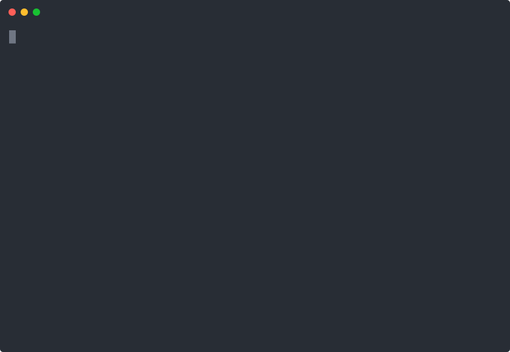

> 🇨🇳 中文文档: [README.zh-CN.md](README.zh-CN.md) | 欢迎中国开发者贡献!

# MCP Observatory

```
  ███╗   ███╗ ██████╗██████╗
  ████╗ ████║██╔════╝██╔══██╗
  ██╔████╔██║██║     ██████╔╝
  ██║╚██╔╝██║██║     ██╔═══╝
  ██║ ╚═╝ ██║╚██████╗██║
  ╚═╝     ╚═╝ ╚═════╝╚═╝
     O B S E R V A T O R Y
```

[](https://github.com/KryptosAI/mcp-observatory/actions/workflows/ci.yml)
[](https://github.com/KryptosAI/mcp-observatory/actions/workflows/codeql.yml)
[](https://github.com/KryptosAI/mcp-observatory/actions/workflows/coverage.yml)
[](https://securityscorecards.dev/viewer/?uri=github.com/KryptosAI/mcp-observatory)
[](./.github/dependabot.yml)
[](./.github/workflows/release.yml)
[](https://www.npmjs.com/package/@kryptosai/mcp-observatory)
[](https://www.npmjs.com/package/@kryptosai/mcp-observatory)
[](https://github.com/KryptosAI/mcp-observatory/stargazers)
[](./LICENSE)
[](./package.json)
[](https://smithery.ai/server/@kryptosai/mcp-observatory)
[](https://glama.ai/mcp/servers/KryptosAI/mcp-observatory)
[](./CONTRIBUTORS.md)
[](https://gitee.com/williamweishuhn/mcp-observatory)
[](https://gitee.com/williamweishuhn/mcp-observatory)
[](https://registry.modelcontextprotocol.io)
[](https://mcpmarket.com)
[](https://mcp-hub.cn)
[](https://opentools.ai)
[](https://gitee.com/williamweishuhn/mcp-observatory)

**MCP Observatory maps the risk graph of agent toolchains before agents depend on them.** It helps teams validate MCP servers before deployment into sensitive, regulated, or mission-critical agentic AI environments.

<p align="center">
  
</p>


Agents should not depend on tools nobody tests. MCP Observatory turns a local MCP check into portable receipts, risk graphs, release-gate evidence, SARIF for GitHub Code Scanning, GitHub Actions gates, schema drift detection, trust status output, score badges, and agent-accessible diagnostics.

```bash
npx @kryptosai/mcp-observatory audit npx -y my-mcp-server --profile nsa-mcp --format markdown --output mcp-audit.md
```

Sample trust output:

```json
{
  "target_id": "my-mcp-server",
  "profile": "nsa-mcp",
  "score": 87,
  "status": "needs_review",
  "finding_count": 2
}
```

The `nsa-mcp` profile is not an official certification. It maps MCP Observatory findings to practical control areas for sensitive environments: trust boundaries, tool permissions, tool description integrity, authentication, secrets exposure, schema validation, input validation, auditability, runtime safety, and supply chain.

## Trust Signals

| Signal | What it means |
|---|---|
| CI + coverage | Typecheck, lint, tests, build, packed install, artifact validation, smoke test, and measured coverage run in GitHub Actions. |
| CodeQL + OpenSSF Scorecard | Static analysis and supply-chain posture are visible in GitHub-native security surfaces. |
| Dependabot | npm and GitHub Actions dependency updates are monitored weekly. |
| npm provenance workflow | Release automation is prepared for npm provenance through GitHub OIDC. |
| Security policy | Vulnerability reports go through private disclosure; see [SECURITY.md](./SECURITY.md). |

## Try It

Run the public evidence loop: generate a receipt, map it into a risk graph, add CI/SARIF, then request a private fleet review when the server matters to production.

```bash
npx @kryptosai/mcp-observatory audit npx -y my-mcp-server --profile nsa-mcp --format markdown --output report.md
npx @kryptosai/mcp-observatory audit npx -y my-mcp-server --profile nsa-mcp --format sarif --output results.sarif
npx @kryptosai/mcp-observatory score npx -y my-mcp-server --profile nsa-mcp --format json
```

Or start with the homepage demo: safely simulate MCP attack-readiness for one server, emit an action receipt, and produce SARIF evidence that maintainers can inspect in GitHub Code Scanning.

```bash
npx @kryptosai/mcp-observatory attack-sim npx -y my-mcp-server --sarif attack-results.sarif
```

Emit the portable trust record:

```bash
npx @kryptosai/mcp-observatory audit npx -y my-mcp-server --profile nsa-mcp --format json --output report.json --receipt receipt.json
npx @kryptosai/mcp-observatory receipt npx -y my-mcp-server --profile nsa-mcp --format markdown --output receipt.md
npx @kryptosai/mcp-observatory risk-graph --input receipt.json --json mcp-risk-graph.json --output mcp-risk-graph.md --html mcp-risk-graph.html
```

Then make the evidence repeatable in CI:

```bash
npx @kryptosai/mcp-observatory setup-ci --all --command "npx -y my-mcp-server" --sarif
```

See the [government and enterprise pilot brief](./docs/government-enterprise-pilot.md), [public guidance crosswalk](./docs/public-guidance-crosswalk.md), [procurement one-pager](./docs/procurement-one-pager.md), [security due diligence packet](./docs/security-due-diligence.md), [NSA-MCP audit CI guide](./docs/nsa-mcp-audit-ci.md), [example NSA-MCP audit report](./docs/examples/nsa-mcp-audit-report.md), [MCP Receipts](./docs/mcp-receipts.md), [MCP Attack Simulator](./docs/mcp-attack-simulator.md), [Tool-call receipts](./docs/tool-call-receipts.md), [MCP Risk Graph](./docs/receipt-graph.md), [private fleet risk graph pilot](./docs/private-mcp-fleet-risk-graph.md), [launch page](./docs/launch.md), [GitHub Code Scanning demo](./docs/code-scanning-demo.md), [GitHub Code Scanning for MCP servers](./docs/github-code-scanning-for-mcp.md), [sample safety reports](./docs/mcp-server-safety-index.md), and [reference evaluations](./docs/reference-evaluations.md).

Want a receipt for a server your agent depends on? Comment on [Drop an MCP server, get a receipt #146](https://github.com/KryptosAI/mcp-observatory/issues/146) or use the [structured receipt request form](https://github.com/KryptosAI/mcp-observatory/issues/new?template=tool-call-receipt-request.yml). Public requests can become Safety Index entries, delta receipts, SARIF evidence, and maintainer CI conversations.

## Evidence You Can Inspect

| Evidence | Where |
|---|---|
| Example GitHub Actions adoption | [`setup-ci --all`](./docs/setup-ci-doctor.md) and the generated workflow docs |
| NSA-MCP audit example | [Markdown report](./docs/examples/nsa-mcp-audit-report.md), [SARIF](./docs/examples/nsa-mcp-results.sarif), and [score JSON](./docs/examples/nsa-mcp-score.json) |
| Procurement and pilot packet | [Public guidance crosswalk](./docs/public-guidance-crosswalk.md), [procurement one-pager](./docs/procurement-one-pager.md), and [security due diligence](./docs/security-due-diligence.md) |
| Attack simulation output | [MCP Attack Simulator](./docs/mcp-attack-simulator.md) |
| MCP receipts | [Portable trust receipts](./docs/mcp-receipts.md) |
| Tool-call receipts | [Receipt standard](./docs/tool-call-receipts.md) for reproducible MCP evidence |
| Risk graph | [Server-to-evidence map](./docs/receipt-graph.md) for agent toolchain trust decisions |
| SARIF / Code Scanning output | [GitHub Code Scanning demo](./docs/code-scanning-demo.md) |
| Real MCP server evaluations | [MCP Server Safety Index](./docs/mcp-server-safety-index.md) |
| Reference reports | [Reference evaluations](./docs/reference-evaluations.md) |
| Maintainer and contributor proof | [MCP Observatory Contributors](./docs/contributor-recognition.md) |
| Open core boundary | [What is open vs. commercial](./docs/commercial-boundary.md) |
| Security disclosure path | [SECURITY.md](./SECURITY.md) |

Two more fast paths:

Cloned this repo? Start here: [`CLONED_THIS.md`](./CLONED_THIS.md). Want to contribute? Add one server to the [MCP Target Registry](./docs/target-registry.md), use the [Agent Task Pack](./docs/agent-tasks.md), and get public credit through [MCP Observatory Contributors](./docs/contributor-recognition.md).

AI coding agents, agentic workflows, and rough PRs are welcome. Use the [10x Agentic Growth Sprint](./docs/10x-agentic-growth-sprint.md), [Agentic Contributor Outreach](./docs/agentic-contributor-outreach.md), or open a `Contributor quest`, `Agentic contribution idea`, or [`Drop an MCP server, get a receipt`](./docs/drop-server-get-receipt.md) issue to suggest a target, prompt, docs fix, receipt, or `setup-ci --sarif` integration.

Add MCP CI and Code Scanning in one command:

```bash
npx @kryptosai/mcp-observatory setup-ci --all --command "npx -y my-mcp-server" --sarif --schedule weekly
```

Repair or upgrade an existing adoption kit:

```bash
npx @kryptosai/mcp-observatory setup-ci --doctor --fix
```

Installing MCP Observatory in an MCP server project also prints the exact CI setup command. Projects can opt into automatic workflow creation during install with [`mcpObservatory.autoSetupCi`](./docs/automatic-ci-integration.md).

Normal `scan` and `test` runs include safe attack-readiness simulation by default. Use `--no-attack-sim` only when you want the older compatibility-only path.

Upload normalized MCP findings to GitHub Code Scanning when you want a security-native release gate:

```bash
npx @kryptosai/mcp-observatory setup-ci --all --command "npx -y my-mcp-server" --sarif
```

Add Observatory as an agent-accessible MCP server:

```bash
claude mcp add mcp-observatory -- npx -y @kryptosai/mcp-observatory serve
```

Building an autonomous agent, OpenClaw-style productivity machine, MCP gateway, or bot runtime? Start with the [agent runtime quickstart](./docs/agent-runtime-quickstart.md), copy the [OpenClaw MCP reliability agent template](./docs/openclaw-agent-template/SOUL.md), or point your agent at [`llms.txt`](./llms.txt) and [`AGENTS.md`](./AGENTS.md).

Or test a server immediately:

```bash
npx @kryptosai/mcp-observatory test npx -y @modelcontextprotocol/server-everything
```

Use it as a CLI, a GitHub Action, or an MCP server that lets your AI agent scan, test, record, replay, and verify other MCP servers autonomously.

<p align="center">
  
</p>

[](https://glama.ai/mcp/servers/KryptosAI/mcp-observatory)

The Glama card is an external MCP directory scorecard. Treat it as directory-level social proof; click through for the underlying category details before using it as a production approval signal.

## Why MCP Observatory

MCP servers are becoming production dependencies. If agents rely on them, teams need a way to catch broken tools, unsafe schemas, schema drift, slow responses, and security footguns before those failures reach users.

Observatory gives maintainers and teams:

- **One-command CI setup** with `setup-ci --all`
- **Profile-mapped audits** with `audit --profile nsa-mcp`
- **MCP receipts** that package target, evidence, verdict, action, and reproduction commands
- **MCP risk graphs** that group servers by capability boundary, receipt state, CI posture, and recommended action
- **Action receipts** that say `allow`, `gate`, `rerun`, `quarantine`, or `escalate`
- **GitHub PR comments** for compatibility, drift, and security findings
- **GitHub Code Scanning SARIF** for normalized MCP findings
- **Health score badges** for public trust signals
- **Record/replay/verify** workflows for regression testing
- **MCP server mode** so agents can inspect other MCP servers directly
- **Production support path** for hosted history, private repo reporting, certification, support, and fleet visibility

See the [launch page](./docs/launch.md), [GitHub Code Scanning for MCP servers](./docs/github-code-scanning-for-mcp.md), [Code Scanning demo](./docs/code-scanning-demo.md), [target gallery](./docs/target-gallery.md), [target registry](./docs/target-registry.md), [target contribution guide](./docs/target-contribution-guide.md), [MCP Observatory Contributors](./docs/contributor-recognition.md), [Agent Task Pack](./docs/agent-tasks.md), [MCP Receipts](./docs/mcp-receipts.md), [Tool-call receipts](./docs/tool-call-receipts.md), [MCP Risk Graph](./docs/receipt-graph.md), [`setup-ci --doctor`](./docs/setup-ci-doctor.md), [MCP server security field guide](./docs/mcp-security-field-guide.md), [Safety Methodology](./docs/methodology.md), [MCP Server Safety Index](./docs/mcp-server-safety-index.md), [June 2026 safety field report](./docs/mcp-safety-field-report-2026-06.md), [reference evaluations](./docs/reference-evaluations.md), [MCP lock files](./docs/mcp-lock-files.md), [public proof](./docs/proof.md), [campaign attribution](./docs/campaign-attribution.md), [local metrics dashboard](./docs/metrics-dashboard.md), [open core boundary](./docs/commercial-boundary.md), [MCP Attack Simulation Evidence Pack](./docs/attack-simulation-pilot.md), [Private MCP Fleet Risk Graph](./docs/private-mcp-fleet-risk-graph.md), and [commercial support](./COMMERCIAL.md).

## For Security And Platform Teams

MCP servers are becoming part of the AI software supply chain. Agents need reliable, testable, auditable tools before those tools become dependencies in mission-critical workflows.

MCP Observatory gives security and platform teams MCP server CI, schema drift detection, security findings, SARIF/HTML/Markdown reports, GitHub Code Scanning upload, and a path toward certification or fleet visibility. Local OSS use stays free; production, private repo, and fleet usage can move through a paid MCP Readiness Review.

## Production Support

Local OSS use stays free under MIT. Teams running MCP in production can use the [Private MCP Fleet Risk Graph](./docs/private-mcp-fleet-risk-graph.md) and [MCP Attack Simulation Evidence Pack](./docs/attack-simulation-pilot.md) for safe-mode attack simulation, SARIF/Code Scanning setup, CI rollout, private evidence reporting, and owner-ready remediation notes. Private fleet risk graph pilots start at `$50,000`; attack simulation packages start at `$15,000`; narrow readiness reviews start at `$2,500`.

The open source repo is the public evidence engine. Private telemetry intelligence, company/account prioritization, commercial ranking weights, hosted fleet workflows, and buyer-specific evidence packs stay outside the OSS package; see the [open core boundary](./docs/commercial-boundary.md).

Run `npx @kryptosai/mcp-observatory cloud`, open a pilot request from the issue chooser, or see [COMMERCIAL.md](./COMMERCIAL.md). Also see [privacy and telemetry](./PRIVACY.md), [campaign attribution](./docs/campaign-attribution.md), and [terms for production use](./TERMS.md).

## Quick Start

Scan every MCP server in your Claude config:

```bash
npx @kryptosai/mcp-observatory
```

Go deeper — also invoke safe tools to verify they actually run:

```bash
npx @kryptosai/mcp-observatory scan deep
```

Test a specific server:

```bash
npx @kryptosai/mcp-observatory test npx -y @modelcontextprotocol/server-everything
```

Add it to Claude Code as an MCP server:

```bash
claude mcp add mcp-observatory -- npx -y @kryptosai/mcp-observatory serve
```

Or add it manually to your config:

```json
{
  "mcpServers": {
    "mcp-observatory": {
      "command": "npx",
      "args": ["-y", "@kryptosai/mcp-observatory", "serve"]
    }
  }
}
```

## Commands

| Command | What it does |
|---------|-------------|
| `scan` | Auto-discover servers, check them, and run safe attack-readiness simulation by default |
| `scan deep` | Scan, run safe attack simulation, and also invoke safe tools to verify they execute |
| `test <cmd>` / `test --target <file>` | Test one server and emit an action receipt by command or target config |
| `record <cmd>` | Record a server session to a cassette file for offline replay |
| `replay <cassette>` | Replay a cassette offline — no live server needed |
| `verify <cassette> <cmd>` | Verify a live server still matches a recorded cassette |
| `diff <base> <head>` | Compare two run artifacts for regressions and schema drift |
| `watch <config>` | Watch a server for changes, alert on regressions |
| `suggest` | Detect your stack and recommend MCP servers from the registry |
| `serve` | Start as an MCP server for AI agents |
| `lock` | Snapshot MCP server schemas into a lock file |
| `lock verify` | Verify live servers match the lock file |
| `history` | Show health score trends for your MCP servers |
| `setup-ci` / `init-ci` | Create a GitHub Action and badge snippet for MCP compatibility/security checks |
| `setup-ci --sarif` | Generate a workflow that uploads normalized findings to GitHub Code Scanning |
| `setup-ci --doctor` | Inspect whether the repository has a complete CI adoption kit |
| `risk-graph --input <path>` | Merge receipts and run artifacts into JSON, Markdown, and HTML MCP risk graphs |
| `--no-attack-sim` | Opt out of the default safe attack simulation on `scan` or `test` |
| `ci-report` | Generate CI report for GitHub issue creation |
| `enterprise-report` | Generate a static production/security report from run artifacts |
| `score <cmd>` | Score an MCP server's health (0-100) |
| `badge <cmd>` | Generate an SVG health score badge for README |
| `cloud` | Show hosted reporting, security review, and enterprise pilot options |

Run with no arguments for an interactive menu:

## What It Does

**Check capabilities** — connects to a server and verifies tools, prompts, and resources respond correctly.

**Invoke tools** — goes beyond listing. Actually calls safe tools (no required params / readOnlyHint) and reports which ones work and which ones crash.

```bash
npx @kryptosai/mcp-observatory scan deep
```

**Detect schema drift** — diffs two runs and surfaces added/removed fields, type changes, and breaking parameter changes.

```bash
npx @kryptosai/mcp-observatory diff run-a.json run-b.json
```

**Recommend servers** — scans your project for languages, frameworks, databases, and cloud providers, then cross-references the [MCP registry](https://registry.modelcontextprotocol.io) to suggest servers you're missing.

```bash
npx @kryptosai/mcp-observatory suggest
```

Or ask your agent "what MCP servers should I add?" when running in MCP server mode.

**Security scanning** — analyzes tool schemas for dangerous patterns: shell injection surfaces, broad filesystem access, missing auth, and credential leakage in responses.

```bash
npx @kryptosai/mcp-observatory test --security npx -y my-mcp-server
```

**Record / replay / verify** — capture a live session, replay it offline in CI, and verify nothing changed. Like [VCR](https://github.com/vcr/vcr) for MCP.

```bash
# Record a session
npx @kryptosai/mcp-observatory record npx -y @modelcontextprotocol/server-everything

# Replay offline (no server needed)
npx @kryptosai/mcp-observatory replay .mcp-observatory/cassettes/latest.cassette.json

# Verify the live server still matches
npx @kryptosai/mcp-observatory verify cassette.json npx -y @modelcontextprotocol/server-everything
```

**Watch for regressions** — re-runs checks on an interval and alerts when something changes.

```bash
npx @kryptosai/mcp-observatory watch target.json
```

### Scan locations

When you run `scan`, it looks for MCP configs in:

- `~/.claude.json` (Claude Code)
- `~/Library/Application Support/Claude/claude_desktop_config.json` (Claude Desktop, macOS)
- `%APPDATA%/Claude/claude_desktop_config.json` (Claude Desktop, Windows)
- `.claude.json` and `.mcp.json` (current directory)

## CI / GitHub Action

Add Observatory to your MCP server's CI pipeline:

```bash
npx @kryptosai/mcp-observatory setup-ci --all --command "npx -y my-mcp-server" --sarif --schedule weekly
```

Check the adoption kit:

```bash
npx @kryptosai/mcp-observatory setup-ci --doctor
```

Successful `test`, `run`, and single-target `scan` checks also offer to convert the passing result into a CI adoption kit. That automatic conversion enables SARIF/Code Scanning and weekly scheduled checks by default; pass `--no-ci-sarif` when you only want a conservative workflow without Code Scanning upload.

Or create the workflow manually:

```yaml
# .github/workflows/observatory.yml
name: MCP Server Check
on: [pull_request]

permissions:
  contents: read

jobs:
  observatory:
    runs-on: ubuntu-latest
    steps:
      - uses: actions/checkout@v4
      - uses: KryptosAI/mcp-observatory/action@v1.28.0
        with:
          command: npx -y my-mcp-server
          deep: true
          security: true
          comment-on-pr: false
          set-status: false
```

Action inputs:

| Input | Description | Default |
|-------|-------------|---------|
| `command` | Server command to test | (required if no `target`) |
| `target` | Path to target config JSON | |
| `targets` | Path to MCP config file for multi-server matrix scan | |
| `deep` | Also invoke safe tools | `false` |
| `security` | Run security analysis | `false` |
| `fail-on-regression` | Fail the action on issues | `true` |
| `fail-on-baseline-drift` | Fail the action when baseline verification detects drift | `true` |
| `comment-on-pr` | Post report as PR comment. Requires `pull-requests: write`. | `true` |
| `set-status` | Set a commit status check (green/red) on the HEAD SHA. Requires `statuses: write`. | `true` |
| `github-token` | Token for PR comments and commit statuses | `${{ github.token }}` |

The action can comment on PRs and set commit statuses when the workflow grants write permissions. `setup-ci` generates read-only third-party-friendly workflows by default and lets maintainers opt into comments/statuses later. `init-ci` remains available as a backward-compatible alias. See [`action/README.md`](./action/README.md) for all options.

Production teams can add hosted CI history, private-repo reporting, recurring security reports, certification review, support, and fleet visibility. Run `npx @kryptosai/mcp-observatory cloud`, see [COMMERCIAL.md](./COMMERCIAL.md), or open a pilot request from the issue chooser.

### Certified by MCP Observatory

MCP server maintainers can add a public compatibility/security signal to their README:

```md
[](https://github.com/KryptosAI/mcp-observatory)
```

Or generate a score badge from a live check:

```bash
npx @kryptosai/mcp-observatory badge npx -y my-mcp-server --output docs/mcp-health.svg
```

See the [certification distribution loop](./docs/certification-distribution.md) for the GitHub Action template, maintainer PR body, and badge rollout playbook.

Generate a pilot-ready production/security report from local run artifacts:

```bash
npx @kryptosai/mcp-observatory enterprise-report \
  --account "Your Company" \
  --format html \
  --output observatory-enterprise-report.html
```

For clearer internal account attribution in CI, set:

```bash
MCP_OBSERVATORY_ORG=your-company.com
MCP_OBSERVATORY_CONTACT=your-team-contact
```

Testing Feishu/Lark integrations? See the [Feishu/Lark MCP guide](./docs/feishu-lark-mcp.md).

### Lock Files

```bash
$ npx @kryptosai/mcp-observatory lock              # Snapshot all server schemas
$ npx @kryptosai/mcp-observatory lock verify        # Verify no drift since last lock
```

Lock files are the package-lock for AI tools: commit the MCP contract, then make every tool, schema, prompt, or resource drift visible in CI. See [MCP lock files](./docs/mcp-lock-files.md).

### Trend Tracking

```bash
$ npx @kryptosai/mcp-observatory history            # Show health trends over time
```

### Nightly Scans

```bash
$ npx @kryptosai/mcp-observatory ci-report          # Generate regression report for CI
```

## MCP Server Mode

**No other testing tool is itself an MCP server.** Add Observatory as a server and your AI agent can autonomously test, diagnose, and monitor your other MCP servers.

```bash
claude mcp add mcp-observatory -- npx -y @kryptosai/mcp-observatory serve
```

Your agent gets 10 tools:

| Tool | When to use it |
|------|---------------|
| `scan` | Check if all your configured MCP servers are healthy |
| `check_server` | Test a specific server before installing or after updating |
| `score_server` | Get a quick health score and grade for a server |
| `record` | Capture a baseline of a working server for future comparison |
| `replay` | Test against a recorded session — no live server needed |
| `verify` | Confirm a server update didn't break anything |
| `watch` | Check a server and see what changed since the last check |
| `diff_runs` | Find regressions between two check results |
| `get_last_run` | Retrieve previous check results for a server |
| `suggest_servers` | Discover MCP servers that match your project stack |

An AI tool that checks other AI tools. It is a tool testing tools that serve tools.

### Security

The MCP server runs inside AI hosts where an LLM chooses which tools to call. To prevent prompt-injection attacks:

- **Command allowlist:** Only `npx`, `node`, `python`, `python3`, `uvx`, `docker`, `deno`, `bun` are permitted as base executables. The CLI has no restrictions.
- **Path validation:** File-reading tools are constrained to the runs/cassettes directories.
- **No arbitrary execution:** Use the CLI for unrestricted commands.

### CLI vs MCP: Intentional Differences

| Feature | CLI | MCP Server | Why |
|---------|-----|------------|-----|
| `watch` | Polling loop | Single check + diff | Request/response doesn't support long-polling |
| Interactive menu | Arrow-key navigation | Not available | MCP has no interactive UI |
| Color output | `--no-color` flag | Always plain text | MCP returns structured content |
| `report` | Renders saved artifacts | Not available | Agents read artifacts directly |
| `serve` | Starts MCP server | N/A | Is the MCP server |
| `run` | Reads target config files | Inline params | MCP tools accept params directly |
| `get_last_run` | Not available (use `ls` + `diff`) | Available | Convenience for agents |

## Compatibility

Works with any MCP server that uses standard transports:

| Transport | Examples | Adapter |
|-----------|----------|---------|
| **stdio** (most servers) | [filesystem](https://www.npmjs.com/package/@modelcontextprotocol/server-filesystem), [memory](https://www.npmjs.com/package/@modelcontextprotocol/server-memory), [context7](https://www.npmjs.com/package/@upstash/context7-mcp), [brave-search](https://www.npmjs.com/package/@modelcontextprotocol/server-brave-search), [sentry](https://www.npmjs.com/package/@sentry/mcp-server), [notion](https://www.npmjs.com/package/@notionhq/notion-mcp-server), [stripe](https://www.npmjs.com/package/@stripe/mcp) | `local-process` |
| **HTTP/SSE** (remote) | [Cloudflare](https://developers.cloudflare.com/mcp/), [Exa](https://exa.ai), [Tavily](https://tavily.com) | `http` |
| **Docker** | All `@modelcontextprotocol/server-*` images | `local-process` via `docker run -i` |

Servers needing API keys work via `env` in the target config. Python servers work via `uvx`. See the [full compatibility matrix](./docs/compatibility.md) for tested servers and known issues.

### Target config files

For more control (env vars, metadata, custom timeout):

```json
{
  "targetId": "filesystem-server",
  "adapter": "local-process",
  "command": "npx",
  "args": ["-y", "@modelcontextprotocol/server-filesystem", "."],
  "timeoutMs": 15000,
  "skipInvoke": false
}
```

```bash
npx @kryptosai/mcp-observatory run --target ./target.json
```

### HTTP / SSE targets

```json
{
  "targetId": "my-remote-server",
  "adapter": "http",
  "url": "https://mcp.example.com/mcp",
  "authToken": "${MCP_SERVER_TOKEN}",
  "headers": {
    "X-Api-Key": "$MCP_SERVER_API_KEY"
  },
  "timeoutMs": 15000
}
```

Target configs support `${VAR}`, `$VAR`, and `env:VAR` references in `authToken`, `headers`, and local-process `env` values.

## How It Compares

| Feature | Observatory | [mcp-recorder](https://github.com/punkpeye/mcp-recorder) | [MCPBench](https://github.com/QuantGeekDev/mcpbench) | [mcp-jest](https://github.com/nicobailon/mcp-jest) |
|---------|:-----------:|:----------:|:-------:|:-------:|
| Auto-discover servers | ✅ | — | — | — |
| Check capabilities | ✅ | — | ✅ | ✅ |
| Invoke tools | ✅ | — | — | ✅ |
| Schema drift detection | ✅ | — | — | — |
| Record / replay | ✅ | ✅ | — | — |
| Verify against cassette | ✅ | — | — | — |
| Response snapshot diffs | ✅ | — | — | — |
| Benchmarking / latency | — | — | ✅ | — |
| Jest integration | — | — | — | ✅ |
| MCP proxy mode | — | ✅ | — | — |
| **Works as MCP server** | **✅** | — | — | — |

Each tool has strengths. Observatory focuses on regression detection and CI-friendly workflows. mcp-recorder is great as a transparent proxy. MCPBench is the go-to for performance benchmarking. mcp-jest is ideal if you're already in a Jest workflow.

## Prior Art

The record/replay/verify pattern is inspired by:

- [VCR](https://github.com/vcr/vcr) (Ruby) — pioneered cassette-based HTTP record/replay
- [Polly.js](https://github.com/Netflix/pollyjs) (Netflix) — HTTP interaction recording for JavaScript
- [mcp-recorder](https://github.com/punkpeye/mcp-recorder) — MCP-specific traffic recording proxy
- [MCPBench](https://github.com/QuantGeekDev/mcpbench) — MCP server benchmarking
- [mcp-jest](https://github.com/nicobailon/mcp-jest) — Jest-style testing for MCP servers

## Limitations

- Servers requiring interactive OAuth (e.g., Google Drive) need pre-authentication before Observatory can connect
- Custom WebSocket transports (e.g., BrowserTools MCP) are not supported
- A few servers time out or close before init — see [known issues](./docs/known-issues.md) and [compatibility](./docs/compatibility.md)

## Contributors ✨

Thanks to these amazing people who have contributed:

- [leemeo3](https://github.com/leemeo3) — 3 Safety Index targets (Git, Chrome DevTools, Filesystem MCP)
- [tanishxdev](https://github.com/tanishxdev) — Legacy CLI deprecation warnings (#187)
- [sansynx](https://github.com/sansynx) — CLI format validation (#182)
- [tanishxdev](https://github.com/tanishxdev) — Legacy CLI deprecation warnings (#187)

[See all contributors →](CONTRIBUTORS.md)

## Contributing

We welcome contributors! This project follows a [Contributor Covenant Code of Conduct](./CODE_OF_CONDUCT.md). The fastest way to get involved:

[](https://github.com/KryptosAI/mcp-observatory/issues?q=is%3Aopen+label%3A%22good+first+issue%22)

```bash
git clone https://github.com/KryptosAI/mcp-observatory.git && cd mcp-observatory && npm install && npm test
```

The most common first contribution is adding an MCP server to the Safety Index (10-15 minutes). See [CONTRIBUTING.md](CONTRIBUTING.md) for full guidelines, code standards, and the contributor recognition ladder.

---

If Observatory saved you a broken deploy, consider giving it a [star](https://github.com/KryptosAI/mcp-observatory). It helps others find the project.
